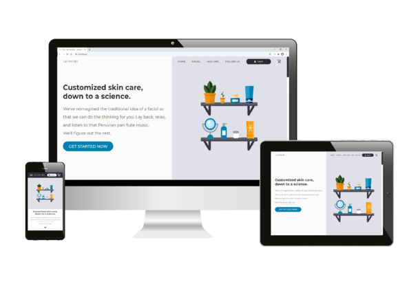

## Functionality

<br/ >
 

This is a MERN (MongoDB, Express, React, Node.js) stack application that uses [Redux](https://github.com/reduxjs/redux) for state management and [Apollo Client](https://www.npmjs.com/package/apollo-boost) to fetch data from a MongoDB database via [GraphQL](https://graphql.org/). It has some of the following features:

<strong>Responsive design, SEO, and performance optimizations by means of:</strong>
* Custom, effective meta tags with [metatags.io](https://metatags.io/) and favicons with [favicon.io](https://favicon.io/).
* SVG compression using [SVGOMG](https://jakearchibald.github.io/svgomg/), static site image compression using [Squoosh](https://squoosh.app/), and user-uploaded image compression using [browser-image-compression](https://www.npmjs.com/package/browser-image-compression) and [LZString](https://github.com/pieroxy/lz-string)).
* Lazy loading and SVG stroke-dashoffset animation triggers and animation on landing page with the [Intersection Observer API](https://www.npmjs.com/package/react-intersection-observer) and [react-spring](https://www.npmjs.com/package/react-spring).
* [Code-splitting](https://reactjs.org/docs/code-splitting.html) along shopping cart routes and authenticated user routes.

<strong>Guest clients are able to:</strong>
* Add and remove facial treatments and add-ons (certain combinations disallowed) from their shopping cart.
* Select a staff member they would like their service with (or, if no preference, select a random staff member).
* Choose an available time and date for their appointment.
* Fill out contact information and any appointment notes.
* Submit credit card information securely through a [Square Payment Form](https://github.com/square/react-square-payment-form) to hold their appointment. This form is an iframe (no credit card information is stored on Glow Labs' MongoDB database. Rather, this information goes to Square's POS).
* Book selected appointments and receive: 
  * Confirmation and reminder texts via [Twilio](https://www.npmjs.com/package/twilio) and [node-cron](https://www.npmjs.com/package/node-cron) (to which they can reply to confirm their appointment).
  * Confirmation emails (created using the [MJML](https://github.com/mjmlio/mjml) markup language) via [Nodemailer](https://www.npmjs.com/package/nodemailer).
  * Link to fill out and sign a consent form.
* Log in or create an account by entering details or using [Passport](https://www.npmjs.com/package/passport-facebook) to authenticate with Facebook via OAuth 2.0. Authentication is done by [JSON Web Tokens](https://jwt.io/introduction/) and [HttpOnly](https://owasp.org/www-community/HttpOnly) access and refresh cookies, as well as an additional client-visible "dummy" cookie after validation.

<strong>Authenticated clients are able to do all of the above, as well as:</strong>
* See upcoming and past appointments.
* Cancel an upcoming appointment.
* Save their credit card information for future bookings, if they wish (again, this card information is not saved to Glow Labs' MongoDB database, but is queried from [Square](https://github.com/square/square-nodejs-sdk)).
* Download PDF copies of their latest consent forms via [React-PDF](https://www.npmjs.com/package/react-pdf).

<strong>Authenticated staff members are able to:</strong>
* Receive real-time relevant activity updates such as new bookings or cancellations in their employee dashboard via GraphQL [subscriptions](https://www.apollographql.com/docs/react/data/subscriptions/) powered by [Google Cloud Pub/Sub](https://cloud.google.com/pubsub/docs/overview).
* View all clients and staff members and each individual's upcoming and past appointments, as well as PDF copies of client consent forms, if present.
* Update client and their own profile photos by uploading a photo or taking a photo with a [webcam](https://github.com/MABelanger/react-html5-camera-photo).
* Add, delete, or update appointments and personal events in their own calendar.

<strong>Authenticated staff members with "admin" status are also able to:</strong>
* Add new staff members.
* Delete clients and staff members.
* Update all clients' and staff members' profile photos.
* View and manage all staff members' calendars.

## Deployment

Server deployed via [AWS EC2](https://aws.amazon.com/ec2/) instance with [NGINX](https://www.nginx.com/) and SSL secured with [Let's Encrypt](https://letsencrypt.org/). Client-side deployed with [Vercel](https://vercel.com/). Custom domain from [Freenom](https://www.freenom.com/) with DNS routing by [Cloudflare](https://www.cloudflare.com/).